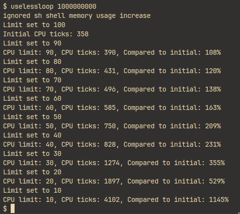
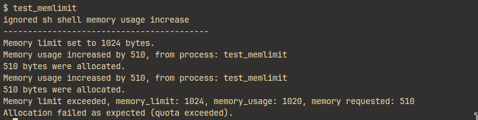

# پیاده‌سازی سیستم کال ها

## محدود کردن سی پی یو

برای این منظور ابتدا مطالعات لازم صورت گرفتن. به این منظور، ریسورس هایی مانند
[این لینک](https://m.youtube.com/watch?v=eYfeOT1QYmg)
استفاده شد که فوق‌العاده مفید بود.


### کاهش مصرف سی پی یو در حالت آیدل

ابتدا نحوه کار کردن اسکجولر مطالعه شد که به صورت راند رابین کار میکند. قبل از هر چیزی، مشاهده شد که
سی پی یو در حالت آیدل در حال استفاده ۱۰۰ درصدی از سی پی یو هاست بود که برای این منظور، اقدام زیر به عمل آمد:

\Begin{latin}

```c
--- a/xv6/proc.c
+++ b/xv6/proc.c
@@ -322,6 +322,7 @@ wait(void)
 void
 scheduler(void)
 {
+  int ran;
   struct proc *p;
   struct cpu *c = mycpu();
   c->proc = 0;
@@ -330,12 +331,16 @@ scheduler(void)
     // Enable interrupts on this processor.
     sti();

+    ran = 0;
+
     // Loop over process table looking for process to run.
     acquire(&ptable.lock);
     for(p = ptable.proc; p < &ptable.proc[NPROC]; p++){
       if(p->state != RUNNABLE)
         continue;

+      ran = 1;
+
       // Switch to chosen process.  It is the process's job
       // to release ptable.lock and then reacquire it
       // before jumping back to us.
@@ -352,6 +357,11 @@ scheduler(void)
     }
     release(&ptable.lock);

+    // halt the cpu if there is no process to run
+    // this makes the cpu usage on the host machine to be lower
+    if (!ran) {
+      hlt();
+    }
   }
 }

diff --git a/xv6/x86.h b/xv6/x86.h
index 07312a5..ccd12b1 100644
--- a/xv6/x86.h

--- a/xv6/x86.h
+++ b/xv6/x86.h
@@ -144,6 +144,12 @@ lcr3(uint val)
   asm volatile("movl %0,%%cr3" : : "r" (val));
 }

+static inline void
+hlt()
+{
+  asm volatile("hlt" : :);
+}
+

```

\End{latin}

برای این منظور، یک دستور هالت در اسمبلی تعریف شده و در اسکجولر اگر هیچ پروسه‌ای برای اجرا وجود نداشت، این دستور اجرا می‌شود.

### محدود کردن سی پی یو

برای این منظور ابتدا در استراکت پراسس، دو عدد فیلد اضافه شد که تعداد تیک های استفاده شده و حداکثر تعداد مجاز استفاده شده را در خود
نگه میدارد:

\Begin{latin}

```c
--- a/xv6/proc.h
+++ b/xv6/proc.h
@@ -49,6 +49,8 @@ struct proc {
   struct file *ofile[NOFILE];  // Open files
   struct inode *cwd;           // Current directory
   char name[16];               // Process name (debugging)
+  int cpu_limit;               // CPU limit (percentage every second)
+  int cpu_ticks;               // CPU ticks used in the last second
 };
```

\End{latin}

سپس یک سیستم کال جدید برای تنظیم این مقدار اضافه شد:

\Begin{latin}

```c
+int
+sys_set_limit(void)
+{
+  int limit;
+  struct proc *p = myproc();
+
+  if(argint(0, &limit) < 0)
+    return -1;
+
+  // TODO: This might need to be atomic?
+  myproc()->cpu_limit = limit;
+
+  cprintf("Limit set to %d\n", limit);
+  return 0;
+}

```

\End{latin}

همچنین یک سری بویلرکد برای اضافه کردن سیستم کال نیز اضافه شده که نیازی به توضیح ندارد. برای دیدن آن ها میتوانید به 
کامیت های مربوط به این تغییرات مراجعه کنید.

سپس در فایل `proc.c` ابتدا ست شد که در هنگام ساخت پروسه، مقدار `cpu_limit` برابر ۱۰۰ درصد باشد و همچنین مقدار `cpu_ticks` صفر شود:

\Begin{latin}

```c

--- a/xv6/proc.c
+++ b/xv6/proc.c
@@ -88,6 +88,8 @@ allocproc(void)
 found:
   p->state = EMBRYO;
   p->pid = nextpid++;
+  p->cpu_limit = 100; // Default CPU limit is 100%
+  p->cpu_ticks = 0; // Initialize CPU ticks used in the last second

   release(&ptable.lock);

```

\End{latin}

یک تابع نیز برای این که `cpu_ticks` را در هر ثانیه صفر کند اضافه شد:

\Begin{latin}

```c
@@ -319,6 +321,18 @@ wait(void)
 //  - swtch to start running that process
 //  - eventually that process transfers control
 //      via swtch back to the scheduler.
+
+void
+reset_CPU_ticks(void)
+{
+  struct proc *p;
+  acquire(&ptable.lock);
+  for(p = ptable.proc; p < &ptable.proc[NPROC]; p++){
+    p->cpu_ticks = 0;
+  }
+  release(&ptable.lock);
+}
+
```

\End{latin}

حالا فقط لازم است که در هنگام انتخاب پروسه برای اجرا، ابتدا بررسی شود که آیا پروسه از حداکثر مجاز استفاده کرده یا نه. اگر کرده بود، پروسه انتخاب نمی‌شود:

\Begin{latin}

```c
@@ -331,6 +345,11 @@ scheduler(void)
     // Enable interrupts on this processor.
     sti();

+    // if (ticks % 100 == 0) {
+    //   // cprintf("Current second: %d, resetting ticks...\n", ticks);
+    //   reset_CPU_ticks();
+    // }
+
     ran = 0;

     // Loop over process table looking for process to run.
@@ -339,14 +358,25 @@ scheduler(void)
       if(p->state != RUNNABLE)
         continue;

+      // Check if the process has exceeded its CPU limit
+      if(p->cpu_limit < p->cpu_ticks) {
+        // cprintf("Process %d exceeded its CPU limit\n", p->pid);
+        // cprintf("Process limit: %d, Process ticks: %d\n", p->cpu_limit, p->cpu_ticks);
+        continue;
+      }
+
       ran = 1;

+
       // Switch to chosen process.  It is the process's job
       // to release ptable.lock and then reacquire it
       // before jumping back to us.
       c->proc = p;
       switchuvm(p);
       p->state = RUNNING;
+      p->cpu_ticks += 1;
+
+      // cprintf("Current tick: %d\n", ticks);

       swtch(&(c->scheduler), p->context);
       switchkvm();
```

\End{latin}

همچنین در اینتراپت تایمر نیز ست میشود که در هر ثانیه، تابع `reset_CPU_ticks` فراخوانی شود:

\Begin{latin}

```c
+  extern void reset_CPU_ticks(void);
+
   switch(tf->trapno){
   case T_IRQ0 + IRQ_TIMER:
     if(cpuid() == 0){
       acquire(&tickslock);
       ticks++;
+
+      if (ticks % 100 == 0) {
+        // cprintf("Current second: %d, resetting ticks...\n", ticks);
+        reset_CPU_ticks();
+      }
+
       wakeup(&ticks);
       release(&tickslock);
     }
```

\End{latin}

همچنین یک برنامه از سمت کاربر نوشته شده که برای امتحان کردن این موضوع، مدام سی پی یو را لیمیت میکند و مشاهده میکند که این موضوع کار میکند یا خیر.

این برنامه یک ورودی از شل به صورت ورودی میگیرد و مدام یک فور لوپ اجرا میکند.

\Begin{latin}

```c
--- /dev/null
+++ b/xv6/uselessloop.c
@@ -0,0 +1,37 @@
+#include "types.h"
+#include "stat.h"
+#include "user.h"
+
+
+int test_cpu_limit(int limit, int ticks) {
+    volatile int i = 0;
+    int starting_time = uptime();
+
+    set_limit(limit);
+
+    while (i < ticks) {
+        i++;
+    }
+
+    return uptime() - starting_time;
+}
+
+int main(int argc, char *argv[]) {
+    int starting_time = uptime();
+
+    int test_ticks = atoi(argv[1]);
+
+    int current_cpu_limit = 100;
+
+    int initial_cpu_ticks = test_cpu_limit(current_cpu_limit, test_ticks);
+    printf(1, "Initial CPU ticks: %d\n", initial_cpu_ticks);
+
```

\End{latin}

اجرای این برنامه نشان میدهد که این موضوع کار میکند و سی پی یو محدود میشود.

{width=50%}

## محدود کردن مموری

برای این منظور ابتدا یک فیلد جدید به استراکت پراسس اضافه شد که مقدار مصرف شده مموری را نگه میدارد و همچنین یک فیلد دیگر برای مقدار مجاز مصرف شده مموری:

\Begin{latin}

```c
+    struct file *ofile[NOFILE]; // Open files
+    struct inode *cwd;          // Current directory
+    char name[16];              // Process name (debugging)
+    int cpu_limit;              // CPU limit (percentage every second)
+    int cpu_ticks;              // CPU ticks used in the last second
+    int memory_limit;           // The memory limit (bytes)
+    int memory_used;            // The memory used so far (bytes)
 };
```

\End{latin}

### سیستم کال جدید

در این راستا تعدادی سیستم کال جدید نیز اضافه شده:

\Begin{latin}

```c
+}
+
+int
+sys_set_mem_limit(void)
+{
+  int limit;
+  struct proc *p = myproc();
+
+  if(argint(0, &limit) < 0)
+    return -1;
+
+  p->memory_limit = limit;
+
+  return 0;
+}
+
+int
+sys_get_mem_limit(void)
+{
+  struct proc *p = myproc();
+{
+  struct proc *p = myproc();
+
+  return p->memory_limit;
+}
+
+int
+sys_increase_mem_limit(void)
+{
+  int limit;
+  struct proc *p = myproc();
+
+  if(argint(0, &limit) < 0)
+    return -1;
+
+  p->memory_limit += limit;
+
+  return 0;
+}
+
+int
+sys_increase_mem_usage(void)
+{
+  int usage;
+  struct proc *p = myproc();
+
+  if(argint(0, &usage) < 0)
+    return -1;
+
+  // Don't increase memory usage if the process is sh
+  if (memcmp(p->name, "sh", 2) == 0) {
+    cprintf("ignored sh shell memory usage increase\n");
+    return 0;
+  }
+
+  p->memory_used += usage;
+  cprintf("Memory usage increased by %d, from process: %s\n", usage, p->name);
+
+  return 0;
+}
+
+int
+sys_get_mem_usage(void)
+{
+  struct proc *p = myproc();
+
+  return p->memory_used;
```

\End{latin}

همچنین اگر توجه شود، جلوی اضافه شدن مموری برای پروسه های شل گرفته شده است. این موضوع،
موجب مشکلاتی در هنگام تست میشد.

### افزایش مموری

در این قسمت فقط و فقط لازم بود که دو تابع `free` و `malloc` را تغییر دهیم که از سیستم کال هایی که نوشته بودیم:

\Begin{latin}

```c

--- a/xv6/umalloc.c
+++ b/xv6/umalloc.c
@@ -3,11 +3,11 @@
 #include "user.h"
 #include "param.h"

+
 // Memory allocator by Kernighan and Ritchie,
 // The C programming Language, 2nd ed.  Section 8.7.

+
 // Memory allocator by Kernighan and Ritchie,
 // The C programming Language, 2nd ed.  Section 8.7.

 typedef long Align;
-
 union header {
   struct {
     union header *ptr;
@@ -25,8 +25,13 @@ void
 free(void *ap)
 {
   Header *bp, *p;
-
   bp = (Header*)ap - 1;
+
+  int size = bp->s.size * sizeof(Header);
+  if (size != 32768) {
+    increase_mem_usage(-size);
+  }
+
   for(p = freep; !(bp > p && bp < p->s.ptr); p = p->s.ptr)
     if(p >= p->s.ptr && (bp > p || bp < p->s.ptr))
       break;
@@ -66,6 +71,20 @@ malloc(uint nbytes)
   Header *p, *prevp;
   uint nunits;

+
+  // Check if the memory that is going to be allocated is
+  // bigger than the maximum size limit of a process
+  int memory_limit = get_mem_limit();
+  int memory_usage = get_mem_usage();
+
+  if (memory_limit != -1  && memory_usage + nbytes > memory_limit) {
+    printf(2, "Memory limit exceeded, memory_limit: %d, memory_usage: %d, memory requested: %d\n", memory_limit, memory_usage, nbytes);
+    return 0;
+  }
+
+  // Increase the memory usage of the process (there is enough memory)
+  increase_mem_usage(nbytes);
+
```

\End{latin}

لازم به ذکر است که در هنگام آزاد کردن مموری یک شرطی خاصی نوشته شده که دلیل آن این است که 
به دلایلی در هنگام اجرا برنامه ها، یک مقدار ثابت به عنوان مموری آزاد شده اضافه میشد که
موجب مشکلاتی میشد. برای این منظور، این موضوع را اصلاح کردیم.

### تست

برای تست این موضوع یک سری تست نوشته شد که از مموری بیشتری استفاده میکند. این تست ها نشان میدهد که این موضوع کار میکند.

\Begin{latin}

```c
+++ b/xv6/test_memlimit.c
@@ -0,0 +1,36 @@
+#include "types.h"
+#include "stat.h"
+#include "user.h"
+
+int main(void) {
+    int alloc_val = 510 * sizeof(char); // Allocate 510 bytes
+
+    printf(1, "------------------------------------------\n");
+
+    // Set memory quota to 1024 bytes
+    if (set_mem_limit(1024) >= 0)
+        printf(1, "Memory limit set to 1024 bytes.\n");
+    else
+        printf(1, "Memory limit could not be set.\n");
+
+    // Allocate memory and test enforcement
+    if (malloc(alloc_val))
+        printf(1, "%d bytes were allocated.\n", alloc_val);
+    else
+        printf(1, "Allocation failed at %d bytes.\n", alloc_val);
+
+    if (malloc(alloc_val))
+        printf(1, "%d bytes were allocated.\n", alloc_val);
+    else
+        printf(1, "Allocation failed at %d bytes.\n", alloc_val);
+
+    // This allocation should fail due to the memory quota
+    if (malloc(alloc_val))
+        printf(1, "%d bytes were allocated (unexpected).\n", alloc_val);
+    else
+        printf(1, "Allocation failed as expected (quota exceeded).\n");
+
+    // printf(1, "------------------------------------------\n");
+
+    exit();
+}
```

\End{latin}

